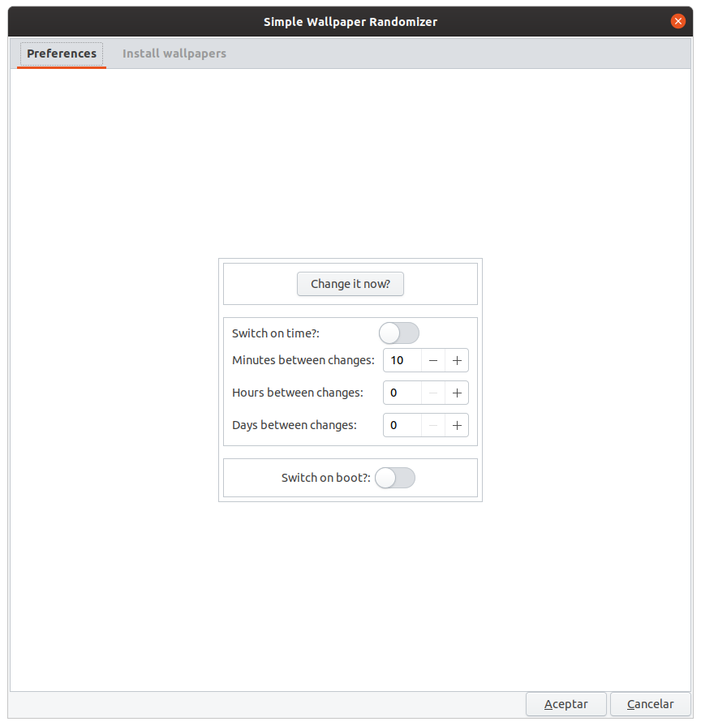
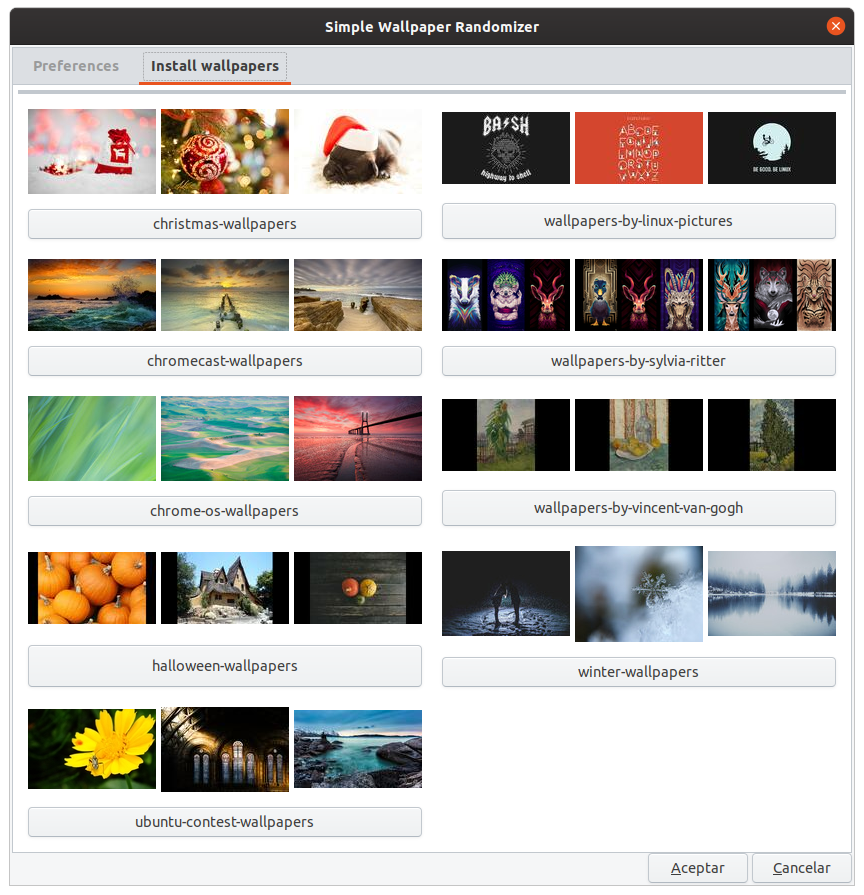

# Simple Wallpaper Randomizer

[](https://www.codacy.com/manual/atareao/simple-wallpaper-randomizer?utm_source=github.com&amp;utm_medium=referral&amp;utm_content=atareao/simple-wallpaper-randomizer&amp;utm_campaign=Badge_Grade)
[](https://www.codefactor.io/repository/github/atareao/simple-wallpaper-randomizer/overview/master)

<!-- ALL-CONTRIBUTORS-BADGE:START - Do not remove or modify this section -->
[](#contributors-)
<!-- ALL-CONTRIBUTORS-BADGE:END -->


[](https://twitter.com/atareao)


simple-wallpaper-charandomizernger is a simple wallpaper changer for Ubuntu

[](https://www.atareao.es/aplicacion/fondos-de-pantalla-para-ubuntu/)


## Prerequisites

Before you begin, ensure you have met the following requirements:

* If you install it from PPA don't worry about, becouse all the requirements are included in the package
* If you clone the repository, you need, at least, these dependecies,

```
python3
python3-crontab
python3-gi
gir1.2-gtk-3.0
```
# Installing Simple Wallpaper Randomizer

To install **Simple Wallpaper Randomizer**, follow these steps:

* In a terminal (`Ctrl+Alt+T`), run these commands

```
sudo add-apt-repository ppa:atareao/wallpapers
sudo apt update
sudo apt install simple-wallpaper-randomizer
```

## Using Simple Wallpaper Randomizer

To use **Simple Wallpaper Randomizer**, open Simple Wallpaper Randomizer, and configure it. After init **Simple Wallpaper Randomizer** you see a window like this one for USB,



Install more wallpapers from `ppa:atareao/wallpapers`



## Contributing to Simple Wallpaper Randomizer

To contribute to **Simple Wallpaper Randomizer**, follow these steps:

1. Fork this repository.
2. Create a branch: `git checkout -b <branch_name>`.
3. Make your changes and commit them: `git commit -m '<commit_message>'`
4. Push to the original branch: `git push origin <project_name>/<location>`
5. Create the pull request.

Alternatively see the GitHub documentation on [creating a pull request](https://help.github.com/en/github/collaborating-with-issues-and-pull-requests/creating-a-pull-request).

## Contributors

Thanks to the following people who have contributed to this project:
<!-- ALL-CONTRIBUTORS-LIST:START - Do not remove or modify this section -->
<!-- prettier-ignore-start -->
<!-- markdownlint-disable -->
<table>
  <tr>
    <td align="center"><a href="https://www.atareao.es"><br /><sub><b>Lorenzo Carbonell</b></sub></a><br /><a href="https://github.com/atareao/simple-wallpaper-randomizer/commits?author=atareao" title="Code">💻</a></td>
  </tr>
</table>

<!-- markdownlint-enable -->
<!-- prettier-ignore-end -->
<!-- ALL-CONTRIBUTORS-LIST:END -->

## Contact

If you want to contact me you can reach me at [atareao.es](https://www.atareao.es).

## License

This project uses the following license: [MIT License](https://choosealicense.com/licenses/mit/).
